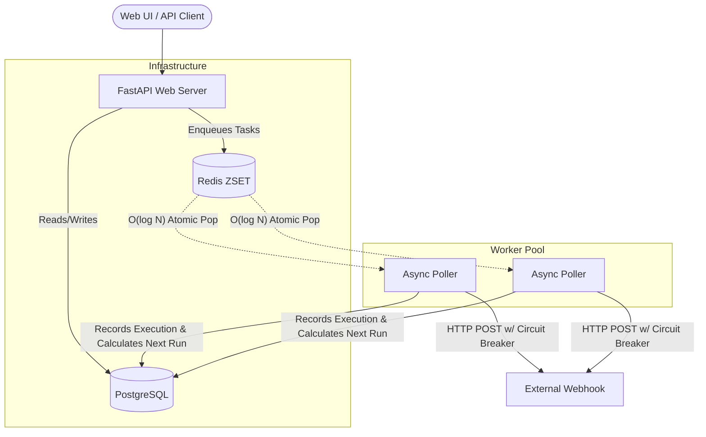

# 🐝 CronHive

**A High-Throughput Distributed Job Scheduling & Webhook Delivery Service**


CronHive is a robust, multi-tenant background job scheduler designed for at-least-once delivery guarantees. It allows users to schedule dynamic HTTP webhooks using standard Cron expressions. Built with distributed systems principles, it handles network failures gracefully and guarantees high-throughput task execution.

---

## 🚀 Features

- **Distributed Priority Queueing**: Uses Redis Sorted Sets (`ZSET`) for O(log N) scheduling and atomic job claiming to prevent thundering herd problems across distributed worker nodes.
- **Circuit Breaker Pattern**: Protects external systems and conserves internal resources by "tripping" and failing fast when a target webhook endpoint is detected as down.
- **Exponential Backoff & Jitter**: Implements randomized exponential backoff for failed executions to ensure network traffic isn't synchronized during outages.
- **Clean / Hexagonal Architecture**: Strictly separates Domain logic, Application Use Cases, and Infrastructure (Database/Queues) for maximum maintainability and testability.
- **SaaS Dashboard**: A fully responsive, modern glassmorphism frontend for monitoring job health, execution logs, manual triggers, and managing templates.

## 🏗 Architecture



## 🛠 Tech Stack

- **Core**: Python 3.12, FastAPI, Pydantic
- **Data Layer**: SQLModel (SQLAlchemy 2.0), asyncpg (PostgreSQL), Alembic (Migrations)
- **Queueing & Rate Limiting**: Redis, redis-py (async)
- **Task Execution**: Httpx, croniter
- **Deployment**: Docker, Docker Compose

## ⚡ Quick Start (Local Development)

Ensure you have Docker and Docker Compose installed.

1. **Clone the repository:**
   ```bash
   git clone https://github.com/yashwanth-me2/CronHive.git
   cd cronhive
   ```

2. **Spin up the stack:**
   ```bash
   docker-compose up -d --build
   ```

3. **Access the Dashboard:**
   Open your browser and navigate to `http://localhost:8000`. The system will automatically generate a Demo User and seed the database with professional templates.

## 🧪 Advanced Operations

The dashboard supports full manual control:
- **Instant Triggering**: Bypass the cron schedule and force a job to execute immediately by clicking "Run".
- **Execution Logs**: View a complete historical log of HTTP status codes, durations, and retry attempts for any job.
- **Pausing/Resuming**: Suspend jobs seamlessly; they are atomically removed from the Redis scheduling queue.

---
*Built as a demonstration of distributed backend architecture and modern web design.*
